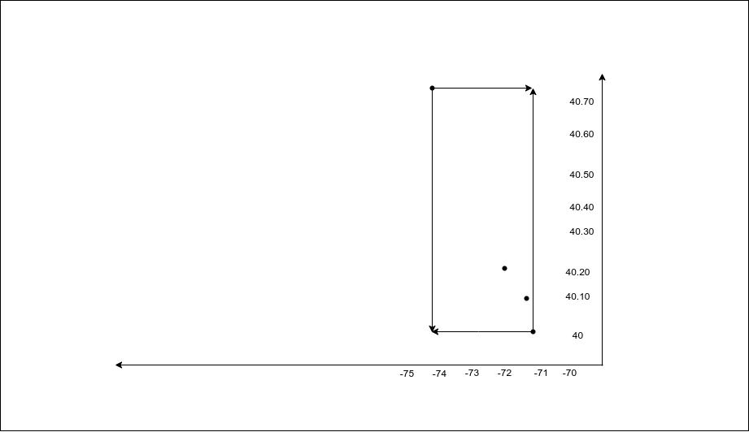

# Geo-bounding box

- Elasticsearch supports two types of geo data:
1. geo_point – supports lat and long
2. geo_shape – which supports points, lines, circles, polygons, multi-polygons etc.

# Bounding-box query:
- To check if particular point(co-ordinate) comes under specified area.
- Boundry box has 2 co-ordinates i.e. `top_left` and `bottom_right`


```
PUT my_locations
{
    “mappings”: {
        “properties”: {
            “pin”: {
                “properties”: {
                    “location” :{
                        “type”: “geo_point”
                    }
                }
            }
        }
    }
}

PUT my_locations/_doc/1
{
    “pin” : {
        “location”: {
            “lat”: 40.12,
            “lon”: -71.34
        }
    }
}

PUT my_locations/_doc/2
{
  "pin": {
    "location":{
      "lat": 40.20,
      "lon": -72.00
    }
  }
}

GET my_location/_search
{
    “query”: {
        “bool”: {
            “must”: {
                “match_all”: {}
            }
            “filter”: {
                “geo_bounding_box”: {
                    “pin.location”: {
                        “top_left”: {
                            “lat”: 40.73,
                            “lon”: -74.1
                        },
                        “bottom_right”: {
                            “lat”: 40.01,
                            “lon”: -71.12
                        }
                    }
                }
            }
        }
    }
}
```

### Output:


## Formats:

### i) Lat lon as properties
```
“geo_bounding_box”: {
    “pin.location”: {
        “top_left”: {
            “lat”: 1,
            “lon”: 2
        },
        “bottom_right”: {
            “lat”: 3,
            “lon”: 4
        }
    }
}
```

### ii) Lat lon as array
```
“geo_bounding_box”: {
    “pin.location”: {
        “top_left”: [ -74.1, 40.73 ],
        “bottom_right”: [-71.12, 40.01]
    }
}
```

### iii) Lat lon as string
```
“geo_bounding_box”: {
    “pin.location”: {
        “top_left”: “POINT (-71.1 40.73)”,	// use space
        “bottom_right”: “POINT (-71.12 40.01)”
    }
}
```

### iV) Lat lon well-known-text (WKT)
```
“geo_bounding_box”: {
    “pin.location”: {
        “wkt”: “BBOX (-74.1, -71.12, 40.73, 40.01)”
    }
}
```

### v) Geohash:
- Use this link to generate geohash values using lat lon http://geohash.co/
```
“geo_bounding_box”: {
    “pin.location”: {
        “top_left”: “dr5r9ydj2y73”,
        “bottom_right”: “drj7teegpus6”
    }
}
```

### vi) Vertices:
- Use vertices separataly like shown below:
```
GET my_locations/_search
{
    “query”: {
        “bool”: {
            “must”: {
                “match_all”: {}
            }
        },
        “filter”: {
            “geo_bounding_box”: {
                “pin.location”: {
                    “top”: 40.73,
                    “left”: -74.1,
                    “bottom”: 40.01,
                    “right”: -71.12
                }
            }
        }
    }
}
```
