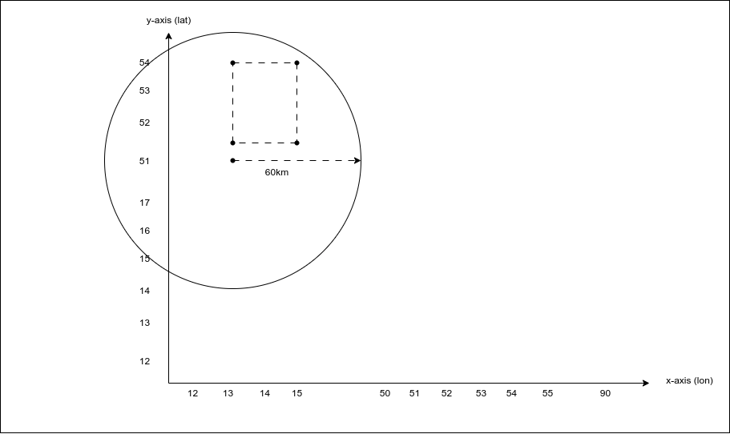

# Geo-distance:

- Used to get all matching geo_point and geo_shape within a given distance of a geopoint.
- Units can be : mi(miles), in (inches), yd (yards), km (kilometers), cm (centimeters), mm (millimeters).

```
GET my_locations/_search
	{
		“query”: {
			“must”: {
				“match_all”: {}
			},
			“filter”: {
				“geo_bounding_box”: {
					“pin.location”: {
						“distance”: “60”,	// can be string or int
						“unit”: “km”,
						“pin.location”: {
							“lat”: 51,
							“lon”: 13
						}
					}
				}
			}
		}
	} 
```

### Output:


## Formats:

Same format as above can use used i.e. (Refer : geo-bounding-box formats)
- Lat lon as properties
- Lat lon as array
- As string
- lat lon as well-known-text (WKT)
- Lat lon as geohash
- Vertices