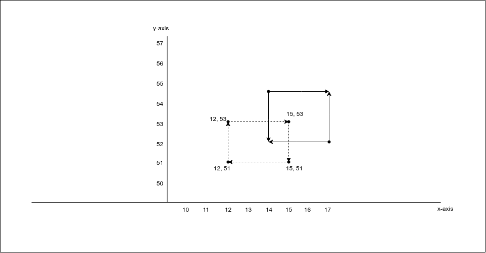
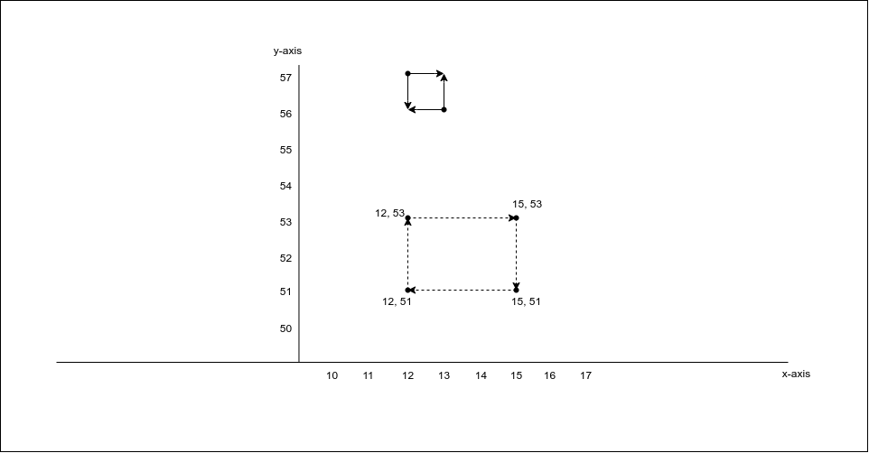
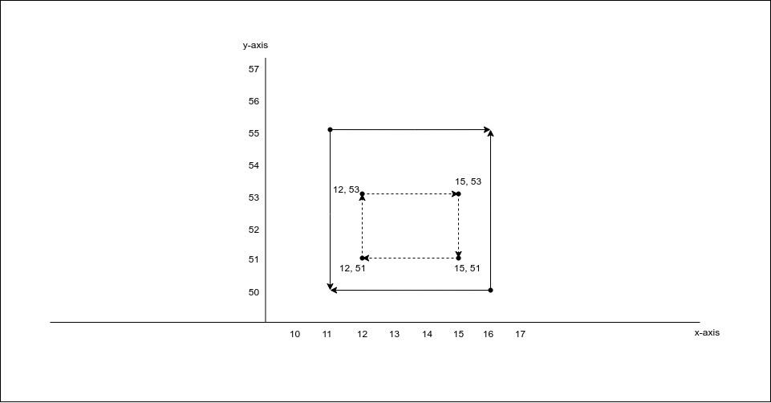
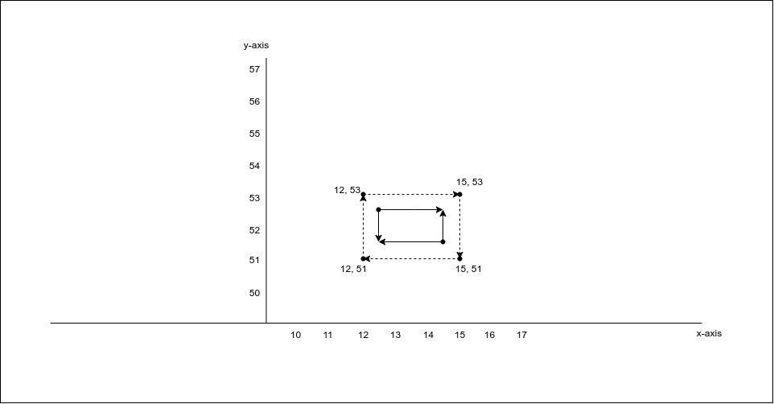

# Geoshape:
- Used to find the document that have a specific shape
- It uses a spatial relationship : either intersect s, contained, within or disjoint.

## Inline Shape Definition:

```
PUT  my_shape_locations
{
    “mappings”: {
        “properties”: {
            “location”: {
                “type”: “geo_shape”     // same can be used with “geo_point”
            }
        }
    }
}

PUT my_shape_locations/_doc/1
{
    “name”: “Wind & Wetter, Berlin, Germany”,
    “location”: {
        “type”: “point”,
        “coordinates”: [ 13.400544, 52.530286 ]
    }
}
```

```
GET my_shape_locations/_search
{
	“query”: {
		“bool”: {
			“must”: {
				“match_all”: {}
			},
			“filter”: {
				“geo_shape”: {
					“location”: {
						“shape”: {
							“type”: “envelope”,
							“coordinates”: [
								[13.0, 53.0],
								[14.0, 52.0]
							]
						},
						“relation”: “within”
					}
				}
			}
		}
	}
}
```

## Pre-Indexed Shape:
- The query also supports using a shape which has already been indexed in another index.
- We need to prodive:
    - id = The id of the document
	- index = The index name. Default is “shapes”
	- path = Path containing the pre-indexed shape. Default is “shape”.
	- routing = The routing if required.

```
PUT pre_index_locations
{
	“mappings”: {
		“properties”: {
			“location”: {
				“type”: “geo_shape”
			}
		}
	}
}

PUT pre_index_locations/_doc/1
{
	“location”: {
		“type”: “envelope”,
		“coordinates”: [
			[13.0, 53.0],
			[14.0, 52.0]
		]
	}
}

GET pre_index_locations/_search
{
	“query”: {
		“bool”: {
			“filter”: {
				“geo_shape”: {
					“location”: {
						“indexed_shape”: {
							“index”: “shapes”,
							“id”: “deu”,
							“path": “locatiom”
						}
					}
				}
			}
		}
	}
}
```

## Spatial relations: 
Spatial relation operators available when searching a geo field:

### 1. Intersects:(Default)
Returns all documents whose “geo_shape” or “geo_point” field intersects the query geometry.

Example:
```
PUT my_locations
{
  "mappings": {
    "properties": {
      "location": {
        "type": "geo_shape"
      }
    }
  }
}

PUT my_locations/_doc/1
{
  "name": "This is test geo shape",
  "location": {
    "type": "Polygon",
    "coordinates": [[
      [12.0, 51.0],
      [15.0, 51.0],
      [15.0, 53.0],
      [12.0, 53.0],
      [12.0, 51.0]
    ]]
  }
}

GET my_locations/_search
{
  "query": {
    "bool": {
      "filter": {
        "geo_shape": {
          "location": {
            "shape": {
              "type": "envelope",
              "coordinates": [
                [
                  14.00,
                  54.50
                ],
                [
                  17.00,
                  52.00
                ]
              ]
            },
            "relation": "intersects"
          }
        }
      }
    }
  }
}
```
### Output:


### 2. Disjoint: 
Returns all documents whose “geo_shape” or “geo_point” fields has nothing in common.
```
GET my_locations/_search
{
  "query": {
    "bool": {
      "filter": {
        "geo_shape": {
          "location": {
            "shape": {
              "type": "envelope",
              "coordinates": [
                [
                  12.00,
                  57.00
                ],
                [
                  13.00,
                  56.00
                ]
              ]
            },
            "relation": "disjoint"
          }
        }
      }
    }
  }
}
```
### Output:


### 3. Within: 
Returns all documents whose “geo_shape” or “geo_point” fields is within the query geometry.  i.e. indexed coordinates are inside searched coordinates.
```
GET my_locations/_search
{
  "query": {
    "bool": {
      "filter": {
        "geo_shape": {
          "location": {
            "shape": {
              "type": "envelope",
              "coordinates": [
                [
                  11.00,
                  55.00
                ],
                [
                  16.00,
                  50.00
                ]
              ]
            },
            "relation": "within"
          }
        }
      }
    }
  }
}
```

### Output:



### 4. Contains: 
Return all documents whose “geo_shape" or “geo_point” field contains the query geometry. i.e. searched coordinates are inside the indexed coordinates.

```
GET my_locations/_search
{
  "query": {
    "bool": {
      "filter": {
        "geo_shape": {
          "location": {
            "shape": {
              "type": "envelope",
              "coordinates": [
                [
                  12.50,
                  52.50
                ],
                [
                  14.50,
                  51.50
                ]
              ]
            },
            "relation": "contains"
          }
        }
      }
    }
  }
}
```

## Output:
